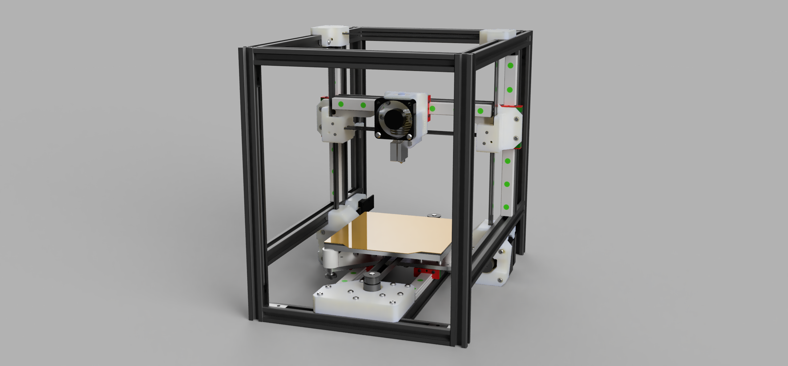

# unnamed-slinger

## Overview
- Work-in-progress 3D printer
- CoreXZ bedslinger, to be enclosed in a 22L IKEA SAMLA storage box (38x28x28 cm^3).
- Electronics and filament spool(s) to be housed separately.

## Summary
- 170mm MGN12 rails with MGN12H carriages (2 on Z axis)
- All-bracketed assembly from 1515L extrusions (NOT Makerbeam 1515 extrusions) and slider nuts
- Build footprint of (120mm)^2, Z height not quite at 120mm, can theoretically squeeze there with compromises
- 23.5mm NEMA17 pancake stepper motors (2 on Y axis)
- V6 Volcano in Bowden setup

## Timeline
- V1 (completed): Get basic printer working (V2: modify toolhead and Y axis)
- V2 (ongoing): Add a bunch of fans and chamber temperature sensors. Add air filter

## Rationale, theory, aims
- Lower moving masses
- Components more likely to be flat, square, straight
- Quick to heat up, with potential to reach hotter temperatures if the motors can stay alive
- Separate printer, electronics and filament
- Transparent and removeable enclosure: Typical printers have massive furniture enclosures or their enclosures are built around the printer frame. These can be inconvenient for travel, cleaning and modding.

## Why CoreXZ
I wanted to use up weak pancake steppers I had lying around. CoreXZ is remarkably symmetrical for a box-style frame, and allows A/B steppers to work together for X movements. I was able to squeeze 2 motors into the Y axis.

It is definitely possible to fit something like a tiny AWD CoreXZ, but this would be severely height limited. It would also be harder to modify the toolhead design. With CoreXZ I can offset the entire XZ axis along Y if desired.

## Uncertainties and potential issues:
- Overheating of motors is probably the most signficant problem. In V1-test, I had not yet installed the motor cooling fans, and there was significant skipping on the Y axis, where the motors are below the heated bed. The skipping may also be due to thermal expansion - For some reason I decided to use 2 linear rails on the Y axis, which is a terrible idea for binding, especially under significant temperature changes.
- There is a pitching moment on the X axis due to weight imbalance from the toolhead. (mostly unavoidable, but potentiall avoided by adding a row of fans as counterweight)
- Unsure whether having fans blowing warm air at parts is good or bad. I thought about adding circulation fans to maintain even temperature and protect parts from hot spots, but apparently circulation can cause uneven temperature variations instead.

## Goals and learning
- Use linear rails for the first time
- Use Klipper for the first time
- Use Fusion 360 for the first time
- Finally be able to print with ABS filament
- Improve understanding of CoreXZ/CoreXY motion systems