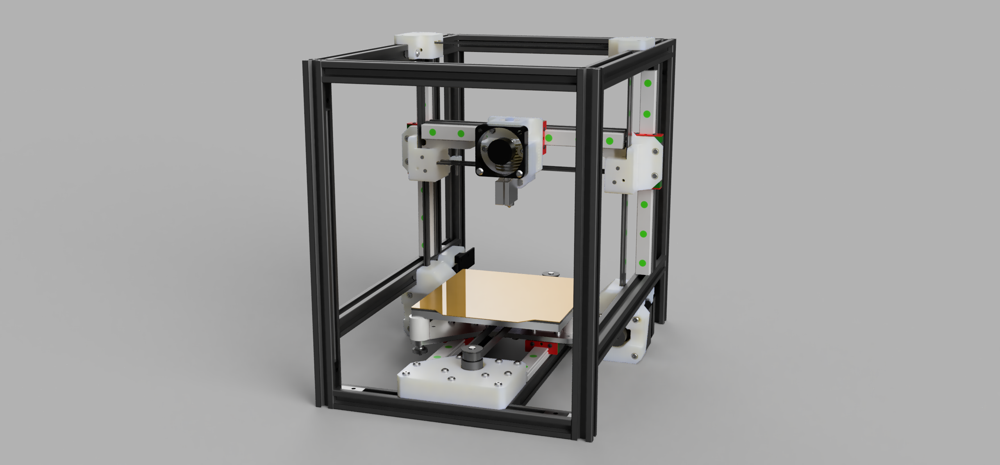
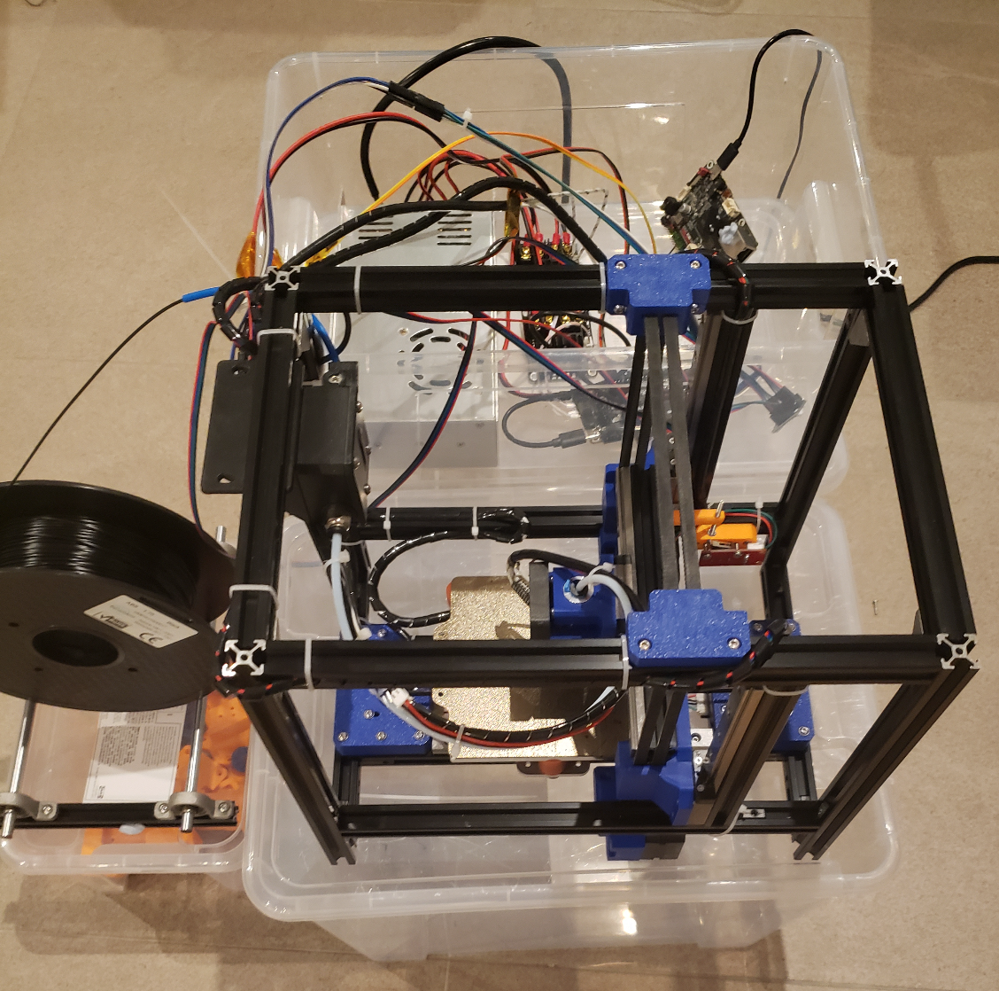

# V1-test summary

First iteration summary:
- Basic toolhead (no part cooling)
- Motor cooling not installed

Issues:
- Skipping steps on Y. Either binding due to thermal expansion with the 2 linear rails, or motors running too hot
- Inconsistent sensorless homing on X/Y due to significant temperature range

Changes for V2:
- Add endstops on X and Y axes
- Design Y axis motor cooling
- Redesign Y axis to use only 1 linear rail. (There are three locations on the Y carriage plate to mount the MGN12)
- Design part cooling on the toolhead
- Design row of part cooling fans behind the X axis
- Design air circulation fans and carbon filter